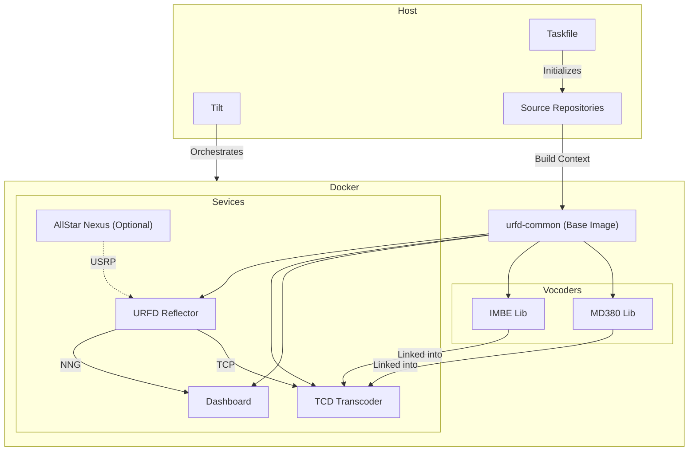

# URFD Development Environment

This directory contains the modernized development workflow for URFD, using [Tilt](https://tilt.dev/), [Docker Compose](https://docs.docker.com/compose/), and [Taskfile](https://taskfile.dev/).

## Architecture

The environment orchestrates multiple services and builds them from local source repositories.



## Prerequisites

### Option 1: Nix (Recommended)

If you have [Nix](https://nixos.org/download.html) installed, you can enter a reproducible shell with all dependencies:

```bash
nix-shell
# or
nix-shell shell.nix
```

### Option 2: macOS (Homebrew)

```bash
brew install tilt go-task docker git
```

#### Using Colima Instead of Docker Desktop

If you're using [Colima](https://github.com/abiosoft/colima) on macOS, you'll need to use the `grpc` port forwarder to support UDP ports (required for digital protocols like M17, DPlus, DExtra, etc.):

```bash
colima start --cpu 4 --memory 8 --disk 100 --port-forwarder grpc --vz-rosetta
```

**Important**: The default `ssh` port forwarder only supports TCP. Since URFD uses many UDP ports for digital voice protocols, the `grpc` port forwarder is required. The `--save-config` flag (enabled by default) will persist this setting for future starts.

### Manual

Ensure you have the following installed:

- [Docker Desktop](https://www.docker.com/products/docker-desktop) or [Colima](https://github.com/abiosoft/colima)
- [Tilt](https://docs.tilt.dev/install.html)
- [Task](https://taskfile.dev/installation/)
- Git

## Quick Start

1. **Initialize the Environment**:
    Clones missing repositories and sets up local configuration.

    ```bash
    task init
    ```

2. **Start Tilt**:
    Builds containers and streams logs.

    ```bash
    tilt up
    ```

    Press `Space` to open the Tilt UI in your browser.

3. **Access Services**:
    - **Tilt UI**: `http://localhost:10350`
    - **Dashboard**: `http://localhost:8080` (or as configured)
    - **URFD**: Ports defined in `docker-compose.yml` (host mode).

## Workflow

### Configuration

- Default configurations are in `config/defaults/`.
- **Do not edit files in `defaults/` directly.**
- Run `task init` to copy them to `config/local/`.
- Edit `config/local/urfd.ini` to change settings. This directory is git-ignored.

### Enabling Optional Components

 To enable **AllStar Nexus** for USRP testing:

 ```bash
 tilt up -- --usrp
 ```

### Rebuilding

- Tilt automatically watches the `Tiltfile` and `config/local` changes.
- Source code changes in `../urfd` etc. will trigger image rebuilds (standard Tilt behavior).
- To force a full rebuild, use the Tilt UI or restart `tilt up`.

## Repository Layout

The setup assumes the following directory structure:

```text
../
├── urfd/
├── tcd/
├── urfd-nng-dashboard/
├── imbe_vocoder/
├── md380_vocoder_dynarmic/
├── allstar-nexus/ (Optional)
└── urfd-tilt/  <-- You are here
    ├── Tiltfile
    ├── Taskfile.yml
    ├── docker-compose.yml
    ├── docker-compose.usrp.yml
    ├── config/
    │   ├── defaults/      # Default configurations (do not edit)
    │   ├── local/         # Your local configurations (git-ignored)
    │   └── dashboard/     # Dashboard configuration
    ├── data/              # Runtime data (git-ignored)
    │   ├── logs/          # URFD logs
    │   ├── audio/         # Audio recordings
    │   └── dashboard/     # Dashboard data
    ├── docker/            # Dockerfiles for services
    └── scripts/           # Utility scripts
```

## Available Tasks

View all available tasks with:

```bash
task --list
```

Common tasks:

- `task init` - Initialize development environment (clone submodules, setup config)
- `task init-config` - Copy default configs to local directory
- `task clean` - Remove local configuration files

## Ports and Services

### Web Interfaces

- **Tilt UI**: http://localhost:10350
- **Dashboard**: http://localhost:8080

### Digital Voice Protocols (UDP)

All UDP ports are exposed for connecting digital voice clients (hotspots, repeaters, transceivers):

- **30001** - DExtra (D-STAR)
- **20001** - DPlus (D-STAR)
- **30051** - DCS (D-STAR)
- **8880** - DMRPlus (DMR)
- **62030** - MMDVM (DMR)
- **17000** - M17
- **42000** - YSF (System Fusion)
- **41000** - P25
- **41400** - NXDN
- **10017** - URF Interlinking

### Service Ports (TCP)

- **10100** - Transcoder (internal TCD connection)
- **40000** - G3 Terminal
- **5555** - NNG Dashboard (internal)
- **5556** - NNG Voice Audio Data (PAIR socket)
- **6556** - NNG Voice Control PTT (REP socket)

**Note**: For UDP port forwarding on macOS with Colima, ensure you're using the `grpc` port forwarder (see Prerequisites section).

## Testing

### Testing UDP Ports

To verify UDP ports are accessible for digital protocols:

```bash
./scripts/test-udp-ports.sh
```

This will test all UDP ports and show which protocols are listening.

## Troubleshooting

### UDP Ports Not Accessible on macOS with Colima

If digital voice clients like Droidstar can't connect to UDP ports, ensure Colima is using the `grpc` port forwarder:

```bash
colima stop
colima start --port-forwarder grpc
```

The default `ssh` port forwarder only supports TCP.

### Viewing Logs

- **Tilt UI**: Press `Space` in the Tilt CLI to open the web UI with streaming logs
- **Docker logs**: `docker logs urfd`, `docker logs tcd`, `docker logs dashboard`
- **URFD log files**: Check `data/logs/` directory

### Clean Rebuild

If you encounter build issues:

```bash
tilt down
docker system prune -a  # Warning: removes all unused Docker resources
task clean
task init
tilt up
```
