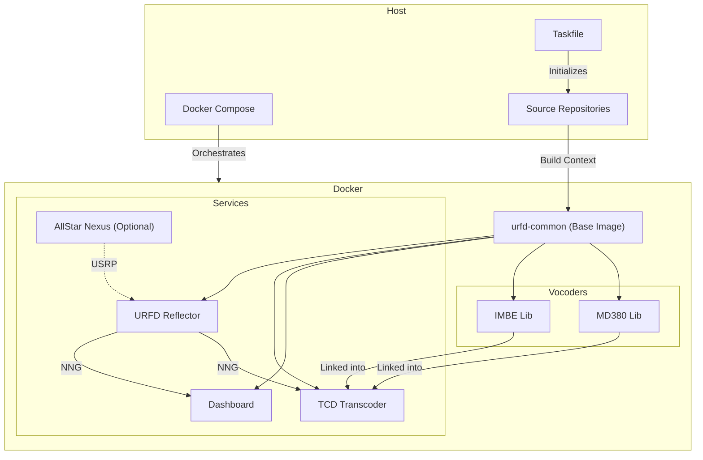

# URFD Development Environment

This directory contains the modernized development workflow for URFD, using [Docker Compose](https://docs.docker.com/compose/) and [Taskfile](https://taskfile.dev/). Tilt remains available, but Compose + Task is the primary local workflow.

**For production deployment**, see the [Production Deployment Guide](deployment/README.md).

## Architecture

The environment orchestrates multiple services and builds them from local source repositories.


```mermaid
graph TD
    subgraph Host
        Compose[Docker Compose]
        Task[Taskfile]
        Repos[Source Repositories]
    end

    subgraph Docker
        Common["urfd-common (Base Image)"]
        
        subgraph Vocoders
            Imbe[IMBE Lib]
            MD380[MD380 Lib]
        end

        subgraph Services
            URFD[URFD Reflector]
            TCD[TCD Transcoder]
            Dash[Dashboard]
            Nexus["AllStar Nexus (Optional)"]
        end
    end

    Compose -->|Orchestrates| Docker
    Task -->|Initializes| Repos
    Repos -->|Build Context| Common
    Common --> Imbe & MD380 & URFD & TCD & Dash
    Imbe & MD380 -->|Linked into| TCD
    URFD -->|NNG| Dash
    URFD -->|NNG| TCD
    Nexus -.->|USRP| URFD
```

## Prerequisites

### Option 1: Nix (Recommended)

If you have [Nix](https://nixos.org/download.html) installed, you can enter a reproducible shell with all dependencies:

```bash
nix-shell
# or
nix-shell shell.nix
```

### Option 2: macOS (Homebrew)

```bash
brew install go-task docker git
```

#### Using Colima Instead of Docker Desktop

If you're using [Colima](https://github.com/abiosoft/colima) on macOS, you'll need to use the `grpc` port forwarder to support UDP ports (required for digital protocols like M17, DPlus, DExtra, etc.):

```bash
colima start --cpu 4 --memory 8 --disk 100 --port-forwarder grpc --vz-rosetta
```

**Important**: The default `ssh` port forwarder only supports TCP. Since URFD uses many UDP ports for digital voice protocols, the `grpc` port forwarder is required. The `--save-config` flag (enabled by default) will persist this setting for future starts.

### Manual

Ensure you have the following installed:

- [Docker Desktop](https://www.docker.com/products/docker-desktop) or [Colima](https://github.com/abiosoft/colima)
- [Task](https://taskfile.dev/installation/)
- Git

## Quick Start

1. **Initialize the Environment**:
    Clones missing repositories and sets up local configuration.

    ```bash
    task init
    ```

2. **Start Compose**:
    Builds containers and streams logs.

    ```bash
    task dev-build
    task dev
    ```

    `task dev-build` builds local `latest` images. `task dev` generates `.env.dev` and starts the Compose stack.

3. **Access Services**:
    - **Dashboard**: `http://localhost:9080` by default (`URF010`)
    - **URFD**: All protocol ports are exposed (see Ports and Services section below)

4. **Run Smoke Checks**:

    ```bash
    task smoke
    ./scripts/test-udp-ports.sh
    ```

## Workflow

### Configuration

- Default configurations are in `config/defaults/`.
- **Do not edit files in `defaults/` directly.**
- Run `task init` to copy them to `config/local/`.
- Edit `config/local/urfd.ini` to change settings. This directory is git-ignored.

### Enabling Optional Components

 To enable **AllStar Nexus** for USRP testing:

 ```bash
 task dev-usrp
 ```

### Multiple Local Instances

The default dev instance is `URF010`, which maps dashboard HTTP to port `9080`. Use another safe instance number to run a second stack:

```bash
task dev INSTANCE=URF011
```

Use separate env files when you want to switch between running instances without regenerating `.env.dev`:

```bash
task dev INSTANCE=URF011 ENV_FILE=.env.URF011.dev
task dev-ps ENV_FILE=.env.URF011.dev
```

The current offset scheme supports `URF000` through `URF035`; higher numbers overflow the highest base port.

### Rebuilding

- Rebuild local images with `task dev-build`.
- Restart the stack with `task dev`.
- Stop the stack with `task dev-down`.
- Follow logs with `task dev-logs`.

## Repository Layout

The project uses git submodules for all source repositories:

```text
urfd-tilt/  <-- You are here
├── Tiltfile
├── Taskfile.yml
├── docker-compose.yml
├── docker-compose.usrp.yml
├── deployment/            # Production deployment tools
│   ├── README.md          # Production deployment guide
│   ├── build/             # Image build scripts
│   ├── scripts/           # Deployment and management scripts
│   └── templates/         # Configuration templates
├── src/                   # Git submodules (initialized by `task init`)
│   ├── urfd/              # URFD reflector source
│   ├── tcd/               # Transcoder source
│   ├── urfd-nng-dashboard/ # Dashboard source
│   ├── imbe_vocoder/      # IMBE vocoder library
│   ├── md380_vocoder_dynarmic/ # MD380 vocoder library
│   └── allstar-nexus/     # AllStar Nexus (optional USRP)
├── config/
│   ├── defaults/          # Default configurations (do not edit)
│   ├── local/             # Your local configurations (git-ignored)
│   └── dashboard/         # Dashboard configuration
├── data/                  # Runtime data (git-ignored)
│   ├── logs/              # URFD logs
│   ├── audio/             # Audio recordings
│   └── dashboard/         # Dashboard data
├── docker/                # Dockerfiles for services
└── scripts/               # Utility scripts
```

## Available Tasks

View all available tasks with:

```bash
task --list
```

Common tasks:

- `task init` - Initialize development environment (clone submodules, setup config)
- `task init-config` - Copy default configs to local directory
- `task clean` - Remove local configuration files

## Ports and Services

### Web Interfaces

- **Dashboard**: http://localhost:9080 by default (`URF010`)

### Digital Voice Protocols (UDP)

All UDP ports are exposed for connecting digital voice clients (hotspots, repeaters, transceivers):

- **30001** - DExtra (D-STAR)
- **20001** - DPlus (D-STAR)
- **30051** - DCS (D-STAR)
- **8880** - DMRPlus (DMR)
- **62030** - MMDVM (DMR)
- **17000** - M17
- **42000** - YSF (System Fusion)
- **41000** - P25
- **41400** - NXDN
- **10017** - URF Interlinking

### Service Ports (TCP)

- **10100** - Transcoder (internal TCD connection)
- **40000** - G3 Terminal
- **5555** - NNG Dashboard (internal)
- **5556** - NNG Voice Audio Data (PAIR socket)
- **6556** - NNG Voice Control PTT (REP socket)

**Note**: For UDP port forwarding on macOS with Colima, ensure you're using the `grpc` port forwarder (see Prerequisites section).

## Testing

### Testing UDP Ports

To verify UDP ports are accessible for digital protocols:

```bash
./scripts/test-udp-ports.sh
```

This will test all UDP ports and show which protocols are listening.

## Troubleshooting

### UDP Ports Not Accessible on macOS with Colima

If digital voice clients like Droidstar can't connect to UDP ports, ensure Colima is using the `grpc` port forwarder:

```bash
colima stop
colima start --port-forwarder grpc
```

The default `ssh` port forwarder only supports TCP.

### Viewing Logs

- **Compose logs**: `task dev-logs`
- **Service logs**: `bash scripts/dev-compose.sh logs -f urfd tcd dashboard`
- **URFD log files**: Check `data/logs/` directory

### Clean Rebuild

If you encounter build issues:

```bash
task dev-down
docker system prune -a  # Warning: removes all unused Docker resources
task clean
task init
task dev-build
task dev
```

## Production Deployment

For deploying URFD in production environments with multiple isolated instances, systemd integration, and proper port management, see the comprehensive [Production Deployment Guide](deployment/README.md).

Production features include:
- Versioned Docker image builds
- Multi-instance deployment with automatic port offsets
- Configuration templates and validation
- Instance lifecycle management (start, stop, restart, upgrade)
- Systemd integration for automatic startup
- Backup and rollback capabilities
